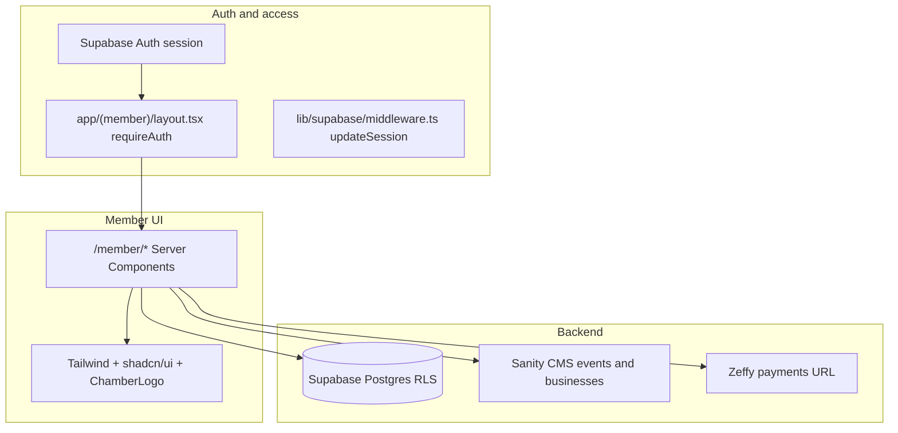

# Member portal structure (chambersite)

## High-level architecture

- **Framework:** Next.js App Router, route group `[app/(member)/](e:\Projects\MP Chamber\chambersite\app\(member)`) (parentheses = no extra URL segment; URLs are still `/member/...`).
- **Auth:** Supabase Auth. Server-side guard `[requireAuth()](e:\Projects\MP Chamber\chambersite\lib\supabase\auth-helpers.ts)` in the member layout redirects unauthenticated users to `/login`. `[getSession()](e:\Projects\MP Chamber\chambersite\lib\supabase\auth-helpers.ts)` / `[getProfile()](e:\Projects\MP Chamber\chambersite\lib\supabase\auth-helpers.ts)` are used on individual pages.
- **Middleware:** Session refresh and redirect logic lives in `[lib/supabase/middleware.ts](e:\Projects\MP Chamber\chambersite\lib\supabase\middleware.ts)` (`updateSession`). Project docs (`[SITE_AUDIT.md](e:\Projects\MP Chamber\chambersite\SITE_AUDIT.md)`) describe wiring this from a **root** `middleware.ts`; the repo snapshot may only contain the lib file—confirm whether a root middleware re-exports `updateSession` in your checkout. **Even without root middleware**, `/member/*` remains protected by the layout’s `requireAuth()`.

---

## URL map and nav source of truth

All member URLs are listed in `[app/(member)/layout.tsx](e:\Projects\MP Chamber\chambersite\app\(member)`\layout.tsx) as `sidebarNav`:

| Path                          | Label in UI       | Primary file                                                                                                               |
| ----------------------------- | ----------------- | -------------------------------------------------------------------------------------------------------------------------- |
| `/member/dashboard`           | Dashboard         | `[member/dashboard/page.tsx](e:\Projects\MP Chamber\chambersite\app\(member)`\member\dashboard\page.tsx)                   |
| `/member/profile`             | Profile           | `[member/profile/page.tsx](e:\Projects\MP Chamber\chambersite\app\(member)`\member\profile\page.tsx)                       |
| `/member/events`              | My Events         | `[member/events/page.tsx](e:\Projects\MP Chamber\chambersite\app\(member)`\member\events\page.tsx)                         |
| `/member/dues`                | Dues & Payments   | `[member/dues/page.tsx](e:\Projects\MP Chamber\chambersite\app\(member)`\member\dues\page.tsx)                             |
| `/member/my-business`         | My Business       | `[member/my-business/page.tsx](e:\Projects\MP Chamber\chambersite\app\(member)`\member\my-business\page.tsx)               |
| `/member/messages`            | Messages          | `[member/messages/page.tsx](e:\Projects\MP Chamber\chambersite\app\(member)`\member\messages\page.tsx)                     |
| `/member/messages/[threadId]` | (thread detail)   | `[member/messages/[threadId]/page.tsx](e:\Projects\MP Chamber\chambersite\app\(member)`\member\messagesthreadId]\page.tsx) |
| `/member/forum`               | Forum             | `[member/forum/page.tsx](e:\Projects\MP Chamber\chambersite\app\(member)`\member\forum\page.tsx)                           |
| `/member/forum/[id]`          | (post + comments) | `[member/forum/[id]/page.tsx](e:\Projects\MP Chamber\chambersite\app\(member)`\member\forumid]\page.tsx)                   |
| `/member/directory`           | Member Directory  | `[member/directory/page.tsx](e:\Projects\MP Chamber\chambersite\app\(member)`\member\directory\page.tsx)                   |

**Layout chrome:** Desktop sidebar + mobile stacked nav; “Back to Website” → `/`; sign-out via `[app/(member)/sign-out-button.tsx](e:\Projects\MP Chamber\chambersite\app\(member)`\sign-out-button.tsx) (client: `supabase.auth.signOut()`, then `window.location.href = "/"`).

---

## UI and design system

### Stack

- **Tailwind CSS v4** with `@import 'tailwindcss'` and `**@theme inline`** in `[app/globals.css](e:\Projects\MP Chamber\chambersite\app\globals.css)` — semantic color tokens (`background`, `foreground`, `primary`, `card`, `muted-foreground`, `border`, `destructive`, etc.) in **light and `.dark`** `:root` blocks; **OKLCH** values; green-tinted primary (`oklch` hue ~145).
- **Typography:** `--font-sans` = DM Sans, `--font-serif` = Playfair (see `globals.css` / root layout font setup); member **page titles** consistently use `font-serif text-3xl font-medium text-foreground` (and variants).
- **shadcn/ui (Radix + CVA):** primitives under `[components/ui/](e:\Projects\MP Chamber\chambersite\components\ui)` — member portal uses at least **Button**, **Input**, **Textarea**, **Dialog**, **AlertDialog**.
- **Icons:** **lucide-react** — nav icons defined next to `sidebarNav` in layout; feature pages use contextual icons (Calendar, CreditCard, MessageSquare, etc.).
- **Feedback:** **sonner** toasts on profile save (`profile-client.tsx`).

### Member shell layout (visual structure)

- **Page background:** `min-h-screen bg-secondary` on the outer wrapper — main content area feels slightly recessed vs **sidebar** and **cards**.
- **Desktop (`lg+`):** Fixed-width `**aside`** `w-64 shrink-0 min-h-screen` with `**bg-card`**, `border-r border-border`, padding `p-6`. Top: `[ChamberLogo](e:\Projects\MP Chamber\chambersite\components\chamber-logo.tsx)` (`heightClass="h-11"`). Nav links: `flex items-center gap-3`, `text-sm text-muted-foreground`, hover `text-foreground` + `hover:bg-secondary` + `rounded-md`. Footer of sidebar: border-top, “Back to Website” + **MemberSignOut** (muted text, hover to destructive tone).
- **Mobile:** No sidebar; `**main`** gets top `**nav`** `lg:hidden` — rounded card (`rounded-xl border bg-card p-3 shadow-sm`), uppercase “Menu” label, same routes as list links with `hover:bg-secondary rounded-lg`.
- **Content column:** `main` is `flex-1 min-w-0 p-4 sm:p-6 lg:p-8` — responsive padding only (no duplicate header bar; first heading comes from each page).

### Repeated page patterns

Most member routes follow the same **card-based** layout language as the public site:

- **Section cards:** `bg-card rounded-lg border border-border p-5` or `p-6`; optional `hover:border-primary/30` on clickable stat cards (dashboard message tile).
- **Grids:** Dashboard uses `grid sm:grid-cols-2 lg:grid-cols-5` for KPI tiles; directory uses `grid sm:grid-cols-2 lg:grid-cols-3`.
- **Tables:** Dues payment history uses a full-width table with `border-b border-border` rows and `text-muted-foreground` headers.
- **Status semantics:** Dues page uses **lucide** `CheckCircle` (green) vs `AlertCircle` (amber) next to membership status copy.
- **Primary actions:** `Button` with default primary styling or `asChild` wrapping `<a>` for external Zeffy links (`ExternalLink` icon).
- **Forum list:** Rows are full-width **links** styled as cards (`block bg-card rounded-lg border p-4`); pinned posts show small **Pin** icon; category as `px-2 py-0.5 bg-secondary rounded text-xs`.

### Feature-specific UI components (by path)

| Area           | Client vs server              | Notable UI pieces                                                                                          |
| -------------- | ----------------------------- | ---------------------------------------------------------------------------------------------------------- |
| Layout         | Server + client sign-out      | Sidebar / mobile menu, ChamberLogo                                                                         |
| Dashboard      | Server                        | Stat cards, two-column lists for RSVPs + forum                                                             |
| Profile        | Client form + server sections | Input fields, save Button, avatar file input, ProfileDeleteSection → AlertDialog                           |
| My Events      | Server                        | Stacked event rows, links to public `/events`                                                              |
| Dues           | Server                        | Status card + Zeffy CTA + table                                                                            |
| My Business    | Server + client form          | Store icon header, inquiry banner + primary link to Messages, MyBusinessForm + Button                      |
| Messages list  | Server                        | Thread list as links, timestamps with **date-fns** `format`                                                |
| Message thread | Server + client reply         | Message bubbles/rows, **ThreadReplyForm** (Textarea + submit Button + loading state), **FlagThreadButton** |
| Forum index    | Server + client dialog        | **CreatePostDialog** → Dialog + Input + Textarea + Button                                                  |
| Forum post     | Server + client               | **CommentForm** → Textarea + Button                                                                        |
| Directory      | Server                        | Avatar circle or placeholder User icon, truncate for long names/orgs                                       |

### Shared components to reuse elsewhere

- `[components/chamber-logo.tsx](e:\Projects\MP Chamber\chambersite\components\chamber-logo.tsx)` — brand in member chrome.
- `[components/ui/*](e:\Projects\MP Chamber\chambersite\components\ui)` — design tokens drive button/input/dialog appearance.
- `[components/business-messages/](e:\Projects\MP Chamber\chambersite\components\business-messages)*` — messaging UX (also used outside member routes if admins moderate threads).

### What the member portal does *not* use

- No separate `(member)` **theme** — same `globals.css` tokens as the public site; only layout differs (sidebar + `bg-secondary` canvas).
- No **data-table** or **sidebar** shadcn primitives for the member shell — custom flex + aside implementation in layout.

---

## Page-by-page behavior and data

### Dashboard (`/member/dashboard`)

- Loads `profiles` row for the user; `event_rsvps` (going); merges with Sanity events via `[lib/event-rsvps](e:\Projects\MP Chamber\chambersite\lib\event-rsvps)` (`mergeRsvpsWithSanityEvents`, `filterUpcomingGoingRsvps`).
- Forum: last 5 `forum_posts`.
- Messages: `[loadThreadsForUser](e:\Projects\MP Chamber\chambersite\lib\business-messaging\load-threads-for-user.ts)` with `claimed_business_id` from profile (business owners see threads where they are the listing owner or the inquirer).
- Links to public event pages `/events/[slug]` and forum `/member/forum/[id]`.

### Profile (`/member/profile`)

- Server wrapper + client form `[profile-client.tsx](e:\Projects\MP Chamber\chambersite\app\(member)`\member\profile\profile-client.tsx): reads/writes `profiles` (name, org, phone, avatar upload to Supabase storage pattern in same file).
- `[profile-upcoming-rsvps.tsx](e:\Projects\MP Chamber\chambersite\app\(member)`\member\profile\profile-upcoming-rsvps.tsx): RSVP summary (Suspense).
- `[profile-delete-section.tsx](e:\Projects\MP Chamber\chambersite\app\(member)`\member\profile\profile-delete-section.tsx): account deletion (typically calls `[app/api/account/delete/route.ts](e:\Projects\MP Chamber\chambersite\app\api\account\delete\route.ts)`—verify in file if extending).

### My Events (`/member/events`)

- `event_rsvps` for user; merged with Sanity events; sections for attending vs cancelled; links to `/events`.

### Dues & Payments (`/member/dues`)

- `profiles.membership_status`, `membership_tier`.
- `membership_payments` history for `user_id`.
- External pay link from `[lib/zeffy](e:\Projects\MP Chamber\chambersite\lib\zeffy)` (`getZeffyMembershipPaymentsUrl`). Webhook side: `[app/api/webhooks/zeffy/route.ts](e:\Projects\MP Chamber\chambersite\app\api\webhooks\zeffy\route.ts)` (not under `/member` but feeds payment rows).

### My Business (`/member/my-business`)

- `profiles.claimed_business_id`; pending `business_claims`.
- If claimed: Sanity business via `[getBusinessById](e:\Projects\MP Chamber\chambersite\lib\sanity\queries.ts)`; `[my-business-form.tsx](e:\Projects\MP Chamber\chambersite\app\(member)`\member\my-business\my-business-form.tsx) + `[app/api/my-business/route.ts](e:\Projects\MP Chamber\chambersite\app\api\my-business\route.ts)` for updates.
- Inquiry count on `business_message_threads` for that `sanity_business_id`.

### Messages (`/member/messages`, `/member/messages/[threadId]`)

- Thread list: `[loadThreadsForUser](e:\Projects\MP Chamber\chambersite\lib\business-messaging\load-threads-for-user.ts)`; enriches with Sanity business labels and `profiles` for participants.
- Thread detail: `business_message_threads` + `business_messages`; UI: `[components/business-messages/thread-reply-form.tsx](e:\Projects\MP Chamber\chambersite\components\business-messages\thread-reply-form.tsx)`, `[flag-thread-button.tsx](e:\Projects\MP Chamber\chambersite\components\business-messages\flag-thread-button.tsx)`.
- REST mirror: `[app/api/business-messages/](e:\Projects\MP Chamber\chambersite\app\api\business-messages)` (`threads`, `threads/[id]`, `threads/[id]/messages`). Server rules in `[lib/business-messaging/server](e:\Projects\MP Chamber\chambersite\lib\business-messaging)` (rate limits, verified business checks).

### Forum (`/member/forum`, `/member/forum/[id]`)

- `forum_posts` with optional join to `profiles` for author name.
- `[create-post-dialog.tsx](e:\Projects\MP Chamber\chambersite\app\(member)`\member\forum\create-post-dialog.tsx) (client); `[comment-form.tsx](e:\Projects\MP Chamber\chambersite\app\(member)`\member\forumid]\comment-form.tsx) on post page.

### Member Directory (`/member/directory`)

- `profiles` where `membership_status === 'active'`; displays name, org, avatar (no emails exposed in the simple grid UI in the current page).

---

## Supabase tables touched by the portal (from code paths)

Use `[lib/supabase/types.ts](e:\Projects\MP Chamber\chambersite\lib\supabase\types.ts)` as the generated schema reference.

- `**profiles`** — id (auth user), `full_name`, `organization`, `phone`, `email`, `avatar_url`, `membership_status`, `membership_tier`, `role`, `claimed_business_id`, …
- `**event_rsvps`** — user RSVPs; `event_id` ties to Sanity events in app logic.
- `**membership_payments`** — payment history rows.
- `**business_claims`** — claim workflow for directory businesses.
- `**business_message_threads**`, `**business_messages**` — messaging.
- `**forum_posts**`, `**forum_comments**` (if used on `[id]` page—confirm in that file).

RLS policies live under `[supabase/migrations/](e:\Projects\MP Chamber\chambersite\supabase\migrations)`; messaging is detailed in migrations such as `009_business_messaging.sql`.

---

## Sanity usage (member-facing)

- **Events:** RSVPs merged with Sanity event documents (slugs, dates, titles).
- **Businesses:** Directory listings by `claimed_business_id` (Sanity document id); queries in `[lib/sanity/queries.ts](e:\Projects\MP Chamber\chambersite\lib\sanity\queries.ts)` (`getBusinessById`, `getBusinessDirectoryLabelsByIds`, etc.).

---

## Other API routes members may hit (non-admin)

Examples: `[app/api/events/rsvp/route.ts](e:\Projects\MP Chamber\chambersite\app\api\events\rsvp\route.ts)`, `[app/api/my-business/route.ts](e:\Projects\MP Chamber\chambersite\app\api\my-business\route.ts)`, `[app/api/account/delete/route.ts](e:\Projects\MP Chamber\chambersite\app\api\account\delete\route.ts)`, business-messages routes above. Admin-only: `[app/api/admin/](e:\Projects\MP Chamber\chambersite\app\api\admin)` (separate from member portal nav).

---

## Contrast: Admin area

- `**/admin/`*** is a different route tree (not under `(member)`); middleware logic in `[lib/supabase/middleware.ts](e:\Projects\MP Chamber\chambersite\lib\supabase\middleware.ts)` requires `profiles.role === 'admin'` or redirects to `/member/dashboard`.

---

## Files to copy or reference in another project

1. **Shell + UI:** `[app/(member)/layout.tsx](e:\Projects\MP Chamber\chambersite\app\(member)`\layout.tsx) + `[sign-out-button.tsx](e:\Projects\MP Chamber\chambersite\app\(member)`\sign-out-button.tsx) + `[app/globals.css](e:\Projects\MP Chamber\chambersite\app\globals.css)` + `[components/ui/](e:\Projects\MP Chamber\chambersite\components\ui)` + `[components/chamber-logo.tsx](e:\Projects\MP Chamber\chambersite\components\chamber-logo.tsx)`.
2. **Auth helpers:** `[lib/supabase/auth-helpers.ts](e:\Projects\MP Chamber\chambersite\lib\supabase\auth-helpers.ts)`, `[lib/supabase/server.ts](e:\Projects\MP Chamber\chambersite\lib\supabase\server.ts)`, `[lib/supabase/client.ts](e:\Projects\MP Chamber\chambersite\lib\supabase\client.ts)`.
3. **Domain libs:** `[lib/event-rsvps](e:\Projects\MP Chamber\chambersite\lib\event-rsvps)`, `[lib/business-messaging/*](e:\Projects\MP Chamber\chambersite\lib\business-messaging)`, `[lib/zeffy.ts](e:\Projects\MP Chamber\chambersite\lib\zeffy.ts)`.
4. **Schema:** Supabase migrations + `types.ts`.

This is a structural map only; duplicate projects should align env vars (`NEXT_PUBLIC_SUPABASE_`*, Sanity, Zeffy URLs) and RLS before expecting identical behavior.